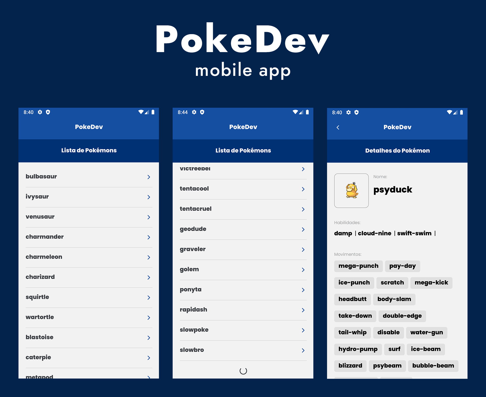

Aplicação em React Native para avaliação. User Interface baseada em vetores gráficos de projeto em Figma.

## Stacks

-   React Native CLI
-   Typescript
-   Axios
-   Styled-Components
-   [PokEAPI](https://pokeapi.co/)

## Outros Recursos

-   React Navigation
-   Scroll infinito com FlatList
-   Context API
